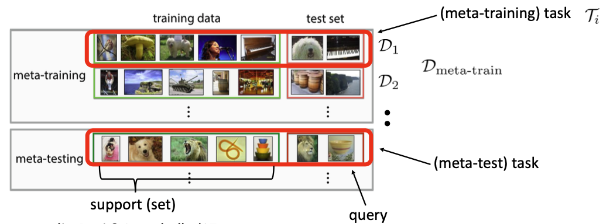
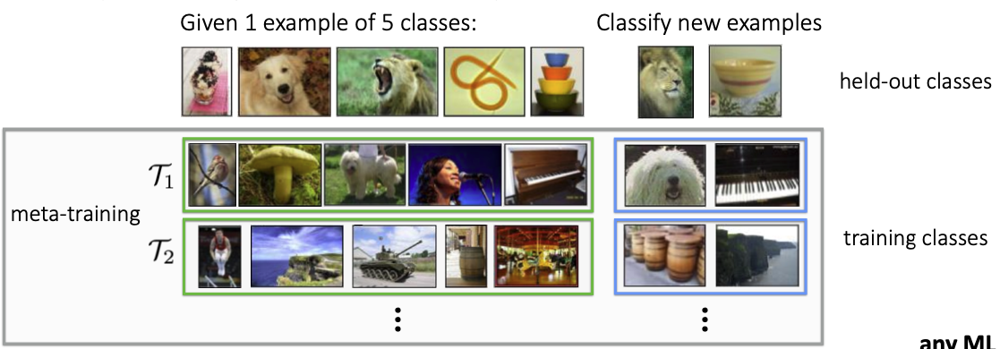
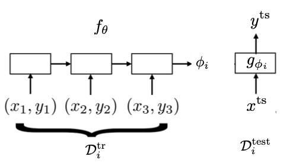
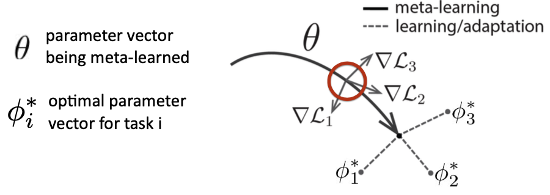

# Meta-Learning

Large, diverse data lead to better generalization

- What if you don’t have a large dataset?
	medical imaging; robotics; personalized education; translation for rare languages; recommendations
- What if you want a general-purpose AI system in the real world?
- What if your data has a long tail?

- Can we explicitly learn priors from previous experience that lead to efficient downstream learning?

{{TOC}}

## Problem statement
Supervised learning:
$$\argmax_\phi \log p(\phi|\mathcal{D})$$
$$=\argmax_\phi\sum_i\log p(y_i|x_i,\phi)+\log p(\phi)$$
where $\mathcal{D}=\{(x_1,y_1),\cdots,(x_k, y_k)\}$

What is wrong with this?
1. The most powerful models typically require large amounts of labeled data
2. Labeled data for some tasks may be very limited

Can we incorporate additional data?
$$\argmax_\phi \log p(\phi|\mathcal{D}, \mathcal{D}_{meta-train})$$
where $\mathcal{D}_{meta-train}=\{\mathcal{D}_1,\cdots,\mathcal{D}_n\}$ and $\mathcal{D}_i=\{(x^i_1,y^i_1),\cdots,(x^i_k, y^i_k)\}$

What if we don’t want to keep $\mathcal{D}_{meta-train}$ around forever?
- learn *meta-parameters* $\theta: p(\theta|\mathcal{D}_{meta-train})$

$$\log p(\phi|\mathcal{D}, \mathcal{D}_{meta-train})=\log \int_\Theta p(\phi|\mathcal{D}, \theta)p(\theta|\mathcal{D}_{meta-train})d\theta$$
$$\approx\log p(\phi|\mathcal{D}, \theta^*)+\log p(\theta^*|\mathcal{D}_{meta-train})$$

- meta-learning: $\theta^* = \argmax\limits_{\theta} \log p(\theta^*|\mathcal{D}_{meta-train})$
- adaptation $\phi^* = \argmax\limits_\phi \log p(\phi|\mathcal{D}, \mathcal{D}_{meta-train})\approx \argmax\limits_\phi \log p(\phi|\mathcal{D}, \theta^*)$

How do we train this?
- key idea: our training procedure is based on a simple machine learning principle: test and train conditions must match

**The complete meta-learning optimization**
- meta-learning: $\theta^* = \argmax\limits_{\theta} \log p(\theta^*|\mathcal{D}_{meta-train})$
- adaptation $\phi^* = \argmax\limits_\phi \log p(\phi|\mathcal{D}, \theta^*)$, abbr. $\phi^*=f_{\theta^*}(\mathcal{D}^{tr})$

Learn $\theta$ s.t. $\phi=f_\theta(\mathcal{D}_i^{tr})$ is good for $\mathcal{D}_i^{ts}$
$$\theta^*=\max_\theta\sum_{I=1}^n\log p(\phi_i|\mathcal{D}_i^{ts})$$
where $\phi_i=f_\theta(\mathcal{D}_i^{tr})$， $\mathcal{D}_{meta-train}=\{(\mathcal{D}_1^{ts}, \mathcal{D}_1^{ts}),\cdots,(\mathcal{D}_n^{tr}, \mathcal{D}_n^{ts})\}$

- meta-training
	- training data
	- test set
- meta-testing
	- support
	- query

**Closely related problems**
1. Multi-task learning: learn model with parameters $\theta^*$ that solves multiple tasks $\theta^* = \argmax\limits_{\theta} \sum\limits_{i=1}^n\log p(\theta^*|\mathcal{D}_{meta-train})$ can be seen as special case where $\phi_i=\theta$.
2. Hyperparameter optimization & Auto-ML: can be cast as meta-learning.
	3. Hyperparameter optimization: $\theta=$ hyperparameters, $\phi=$ network weights;
	4. Architecture search: $\theta=$ architecture, $\phi=$ network weights.

## Meta-learning algorithms
**How to evaluate a meta-learning algorithm**

**How to design a meta-learning algorithm**
1. Choose a form of $p(phi_i|\mathcal{D}_i^{tr},\theta)$
2. Choose how to optimize $\theta$ w.r.t. max-likelihood objective using $\mathcal{D}_{meta-train}$
### Black-box adaptation
**Key idea:** Train a neural network to represent $p(phi_i|\mathcal{D}_i^{tr},\theta)$

Use RNN to input data samples and output model parameters.
$$\max_\theta\sum_{\mathcal{T}_i}\sum_{(x,y)\sim\mathcal{D}_i^{test}}\log g_{\phi_i}(y|x)$$

1. Sample task $\mathcal{T}_i$
2. Sample disjoint datasets $\mathcal{D}_i^{tr}$, $\mathcal{D}_i^{test}$ from $\mathcal{D}_i$
3. Compute $\phi_i\leftarrow f_\theta(\mathcal{D}_i^{tr})$
4. Update $\theta$ using $\nabla_\theta\mathcal{L}(\phi_i,\mathcal{D}_i^{test})$
### Optimization-based inference
**Key idea:** Acquire $\phi_i$ through optimization

**Fine-tuning**: $\phi\leftarrow\theta-\alpha\nabla_\theta\mathcal{L}(\theta,\mathcal{D}^{tr})$

**Meta-learning**: $\min_\theta\sum_{task_i}\mathcal{L}(\theta-\alpha\nabla_\theta\mathcal{L}(\theta,\mathcal{D}^{tr}),\mathcal{D}^{ts})$

**Key idea:** Over many tasks, learn parameter vector θ that transfers via fine-tuning

1. Sample task $\mathcal{T}_i$
2. Sample disjoint datasets $\mathcal{D}_i^{tr}$, $\mathcal{D}_i^{test}$ from $\mathcal{D}_i$
3. Optimize $\phi_i\leftarrow\theta-\alpha\nabla_\theta\mathcal{L}(\theta,\mathcal{D}^{tr}_i)$
4. Update $\theta$ using $\nabla_\theta\mathcal{L}(\phi_i,\mathcal{D}_i^{test})$ 

|Optimization | Black-Box Adaptation|
|-|-|
|1|2|

### Non-parametric methods

### Bayesian meta-learning

## Meta-learning applications

## Meta-reinforcement learning

## Challenges & frontiers
