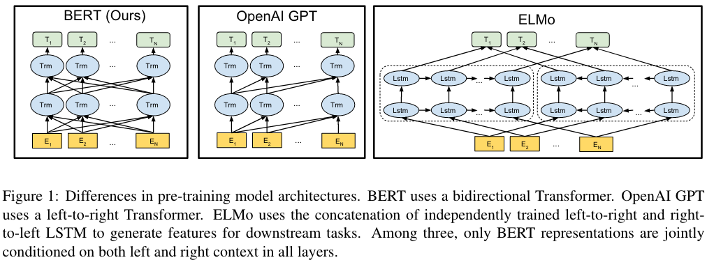
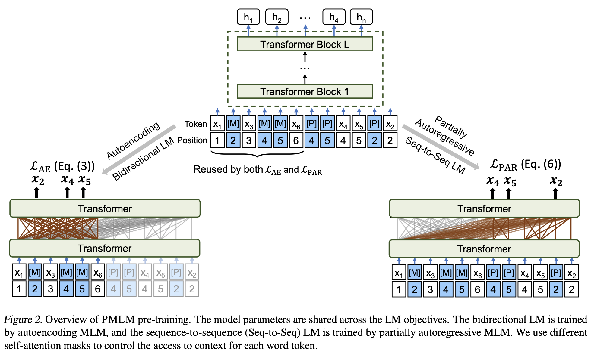
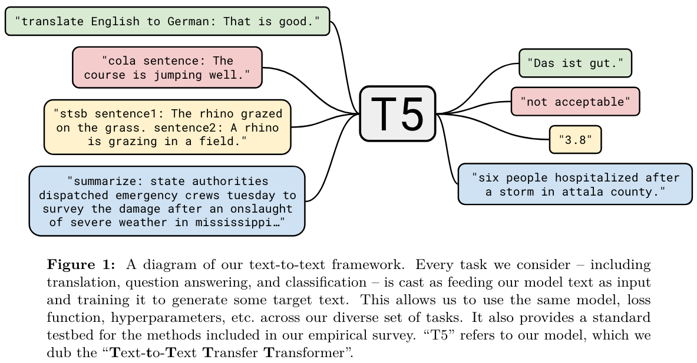
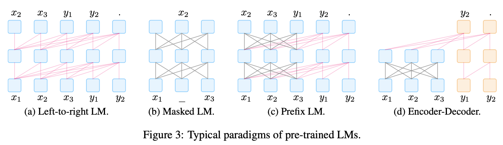
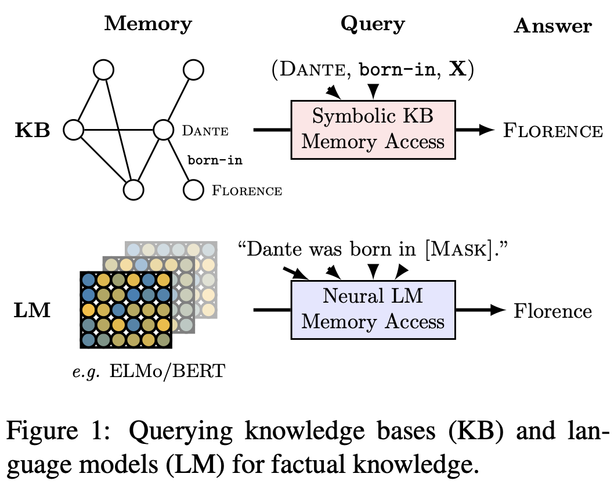
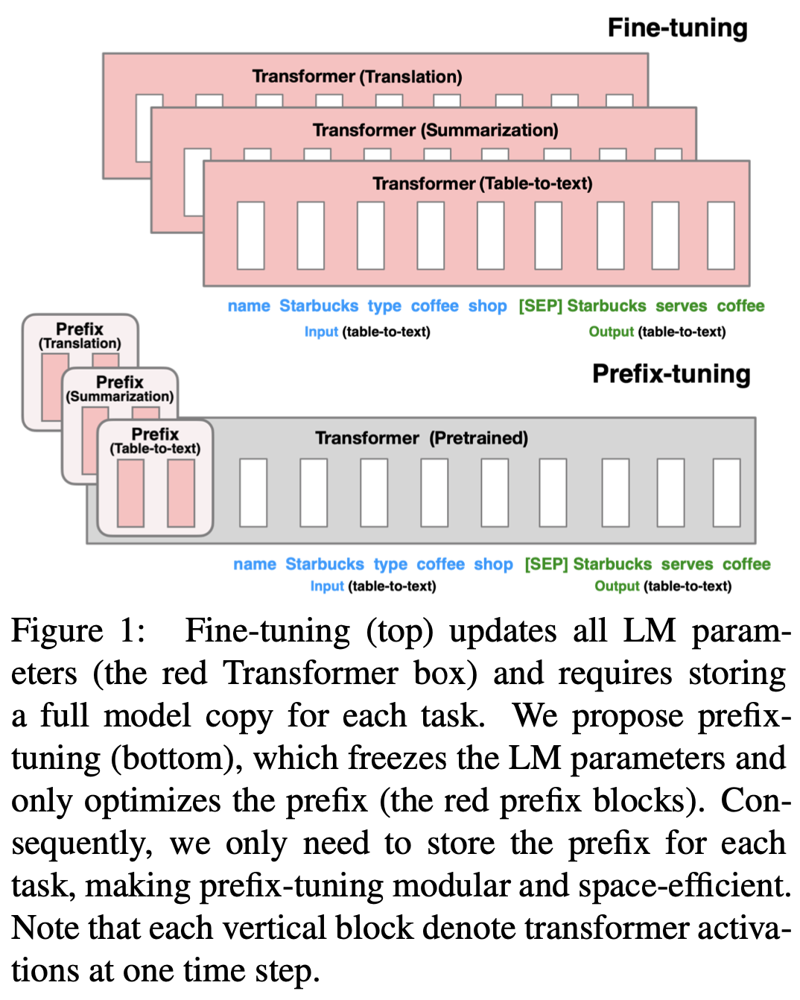
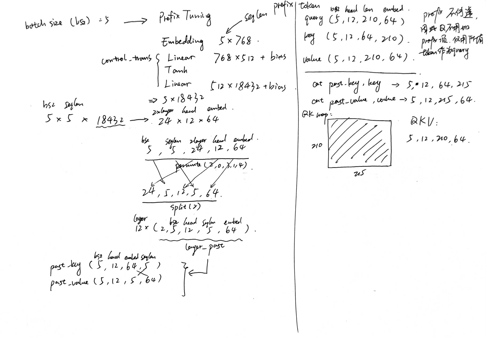
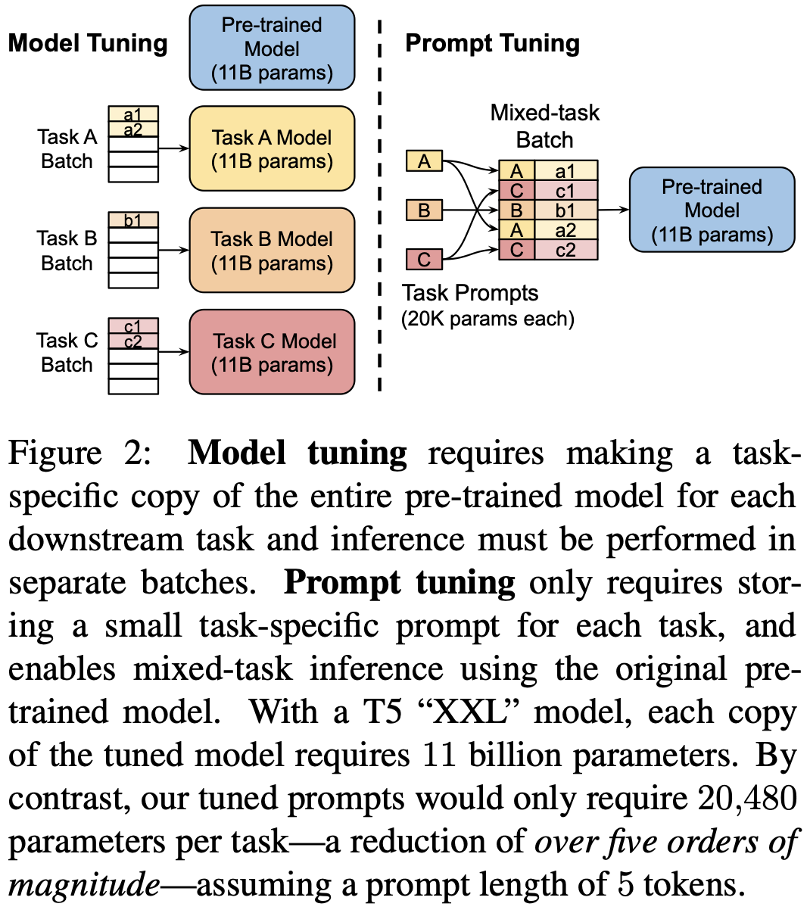

# 
 Prompt Learning

## Typology of Prompting Methods
*refer to [NLPedia](https://github.com/pfliu-nlp/NLPedia-Pretrain)*

### Pre-traiÍned Models (Detailed Description)

- Left-to-right Language Model
	
	[GPT](https://cdn.openai.com/research-covers/language-unsupervised/language_understanding_paper.pdf)
	[GPT2](https://cdn.openai.com/better-language-models/language_models_are_unsupervised_multitask_learners.pdf)
	[GPT3](https://arxiv.org/pdf/2005.14165.pdf)
	
- Masked Language Model

	#### [BERT: Pre-training of Deep Bidirectional Transformers for Language Understanding](https://arxiv.org/pdf/1810.04805.pdf)
	
	
- Prefix Language Model

	#### [UNILMv2: Pseudo-Masked Language Models for Unified Language Model Pre-Training](https://arxiv.org/pdf/2002.12804.pdf)
	
	
- Encoder-Decoder
	#### [Exploring the Limits of Transfer Learning with a Unified Text-to-Text Transformer](http://arxiv.org/pdf/1910.10683.pdf)



### Prompt Engineering (Detailed Description)

- Shape
	- Cloze prompt: 
	#### [Language Models as Knowledge Bases?](https://aclanthology.org/D19-1250.pdf)
	
	
	- Prefix prompt: 
	#### [Prefix-Tuning: Optimizing Continuous Prompts for Generation](https://aclanthology.org/2021.acl-long.353.pdf)
		
	
	#### [The Power of Scale for Parameter-Efficient Prompt Tuning](https://aclanthology.org/2021.emnlp-main.243.pdf)
	
	
	
- Human Effort
	- Hand-crated
	- Automated
		- Discrete: 
		- Continuous: 

### Answer Engineering (Detailed Description)

- Shape
	- Token: 
	- Span: 
	- Sentence: 
- Human Effort
	- Hand-crated: 
	- Automated
		- Discrete: 
		- Continuous: 
### Multi-Prompt Learning (Detailed Description)

- Prompt Ensemble: 
- Prompt Augmentation: 
- Prompt Composition: 
- Prompt Decomposition: 

### Prompt-based Training Strategies (Detailed Description)

- Parameter Updating
	- Promptless Fine-tuning
	- Tuning-free Prompting: 
	- Fixed-LM Prompt Tuning: 
	- Fixed-prompt LM Tuning: 
	- Prompt+LM Tuning: 
- Training Sample Size
	- Zero-shot: 
	- Few-shot: 
	- Full-data: 