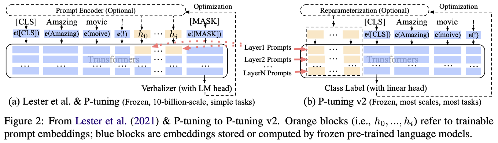
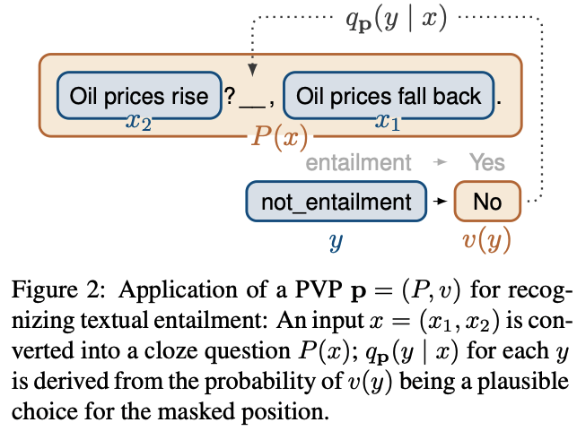
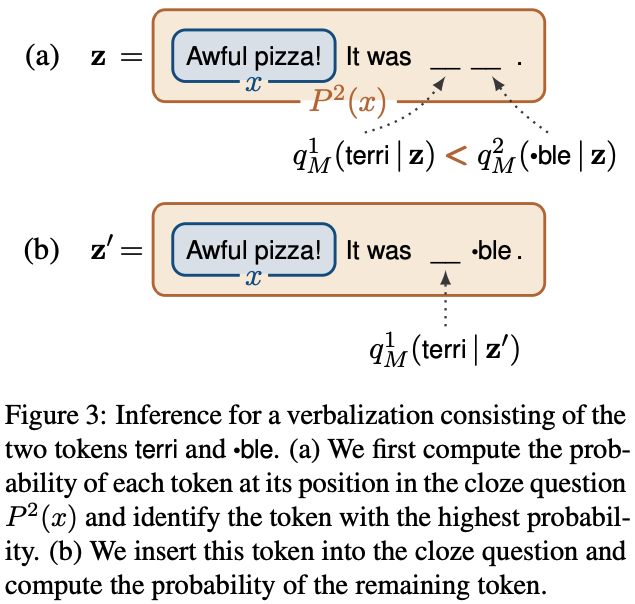

# 
 Prompt Learning

## Typology of Prompting Methods
*refer to [NLPedia](https://github.com/pfliu-nlp/NLPedia-Pretrain)*

### Pre-traiÍned Models (Detailed Description)

- Left-to-right Language Model
	
	[GPT](#improving-language-understanding-by-generative-pre-training)
	
	[GPT-2](#language-models-are-unsupervised-multitask-learners)
	
	[GPT-3](#language-models-are-few-shot-learners)
	
- Masked Language Model

	[BERT](#bert-pre-training-of-deep-bidirectional-transformers-for-language-understanding-1)
		
- Prefix Language Model

	[UNILMv2](#unilmv2-pseudo-masked-language-models-for-unified-language-model-pre-training-1)
	
- Encoder-Decoder

	[T5](#exploring-the-limits-of-transfer-learning-with-a-unified-text-to-text-transformer-1)
	

### Prompt Engineering (Detailed Description)

- Shape
	- Cloze prompt: 

		[LAMA](#language-models-as-knowledge-bases)

	- Prefix prompt: 

		[Prefix-Tuning](https://aclanthology.org/2021.acl-long.353.pdf)
		
		[Prompt Tuning](https://aclanthology.org/2021.emnlp-main.243.pdf)
		
- Human Effort
	- Hand-crated
		
		[LAMA](#language-models-as-knowledge-bases)
		
		[GPT-3](#language-models-are-few-shot-learners-gpt-3)
	- Automated
		- Discrete: 

			[AUTOPROMPT](#autoprompt-eliciting-knowledge-from-language-models-with-automatically-generated-prompts)
	
			[AdvTrigger](#universal-adversarial-triggers-for-attacking-and-analyzing-nlp)
						
		- Continuous: 

			[Prefix-Tuning](#prefix-tuning-optimizing-continuous-prompts-for-generation)
			
			[Prompt Tuning](#the-power-of-scale-for-parameter-efficient-prompt-tuning)

### Answer Engineering (Detailed Description)

- Shape
	- Token: 
	
		[WARP](#warp-word-level-adversarial-reprogramming)
		
		[LAMA](#language-models-as-knowledge-bases)

	- Span: 

		[PET-GLUE](#its-not-just-size-that-matters-small-language-models-are-also-few-shot-learners)
		PET-GLUE: PET with Multiple Masks
		
		[X-FACTR](#x-factr-multilingual-factual-knowledge-retrieval-from-pretrained-language-models)
		
	- Sentence: 
		
		[GPT-3](#language-models-are-few-shot-learners-gpt-3)
		
		[Prefix-Tuning](#prefix-tuning-optimizing-continuous-prompts-for-generation)
- Human Effort
	- Hand-crated: 

		[PET](#exploiting-cloze-questions-for-few-shot-text-classification-and-natural-language-inference)
		
		[PET-GLUE](#its-not-just-size-that-matters-small-language-models-are-also-few-shot-learners)
		
	- Automated
		- Discrete: 
			
			[LM-BFF](#making-pre-trained-language-models-better-few-shot-learners)
						
			[AutoPrompt](#autoprompt-eliciting-knowledge-from-language-models-with-automatically-generated-prompts)
			
		- Continuous: 

			[WARP](#warp-word-level-adversarial-reprogramming)
### Multi-Prompt Learning (Detailed Description)

- Prompt Ensemble: 
- Prompt Augmentation: 
- Prompt Composition: 
- Prompt Decomposition: 

### Prompt-based Training Strategies (Detailed Description)

- Parameter Updating
	- Promptless Fine-tuning
		
		[BERT](#bert-pre-training-of-deep-bidirectional-transformers-for-language-understanding)
		
	- Tuning-free Prompting: 

		[GPT-3](#language-models-are-few-shot-learners-gpt-3)
		
	- Fixed-LM Prompt Tuning: 

		[Prefix-Tuning](#prefix-tuning-optimizing-continuous-prompts-for-generation)
		
		[WARP](#warp-word-level-adversarial-reprogramming)

	- Fixed-prompt LM Tuning: 

		[T5](#exploring-the-limits-of-transfer-learning-with-a-unified-text-to-text-transformer)
		
		[PET](#exploiting-cloze-questions-for-few-shot-text-classification-and-natural-language-inference)
		
	- Prompt+LM Tuning: 

		[P-Tuning](https://arxiv.org/pdf/2103.10385.pdf)
		
		[PTR](#ptr-prompt-tuning-with-rules-for-text-classification)

- Training Sample Size
	- Zero-shot: 

		[GPT-3](#language-models-are-few-shot-learners-gpt-3)
		
	- Few-shot: 

		[PET](#exploiting-cloze-questions-for-few-shot-text-classification-and-natural-language-inference)
		
	- Full-data: 
		
		[KnowPrompt](https://arxiv.org/pdf/2104.07650)
		
		
		[PTR](#exploiting-cloze-questions-for-few-shot-text-classification-and-natural-language-inference)
		
		
## Detailed Papers

#### [GPT Understands, Too (P-Tuning)](https://arxiv.org/pdf/2103.10385.pdf)
[code](https://github.com/THUDM/P-tuning)

*Category*
- Model: BERT/GPT2
- Prompt: continuous, cloze
- Answer: token
- Learning: Fixed-LM Prompt tuning

*Challenges*
- Discreteness: random initialized prompt embedding would fall into local minima.
- Association: intuitively, the author believe the values of prompt embedding should be dependent on each other.

*Method*

- P-tuning use pseudo prompts with trainable embedding. 
- To solve discreteness and association, P-tuning use a BiLSTM to generate prompt embedding.
- In the inference, keep only embedding and discard LSTM.

#### [P-Tuning v2: Prompt Tuning Can Be Comparable to Fine-tuning Universally Across Scales and Tasks](https://arxiv.org/pdf/2110.07602.pdf)
[code](https://github.com/THUDM/P-tuning-v2)

*Category*
- Model: BERT/GLM
- Prompt: continuous, cloze
- Answer: token
- Learning: Fixed-LM Prompt tuning

*Method*
- P-tuning v2 employs the idea of deep prompt tuning as [Prefix-tuning](#prefix-tuning-optimizing-continuous-prompts-for-generation)
- Reparameterization performs differently in different datasets.
- Randomly-initialized classification head to predict label.

#### [PTR: Prompt Tuning with Rules for Text Classification](https://arxiv.org/pdf/2105.11259.pdf)
[code](https://github.com/thunlp/PTR)

*Category*
- Model: BERT
- Prompt: continuous, cloze
- Answer: token (label words)
- Learning: Prompt+LM tuning

*Challenges*
- most auto-generated prompts cannot achieve comparable performance to human- picked ones
- auto-generated prompts require extra computation costs for generation and verification

*Method*
- Using three conditional function to determine the subject entity types, the object entity types and the semantic connection between entities.
- Usinh sub-prompts for conditional function.
- Composing sub-prompts for tasks.

#### [WARP: Word-level Adversarial ReProgramming](https://aclanthology.org/2021.acl-long.381.pdf)
[code](https://github.com/YerevaNN/WARP)

*Category*
- Model: RoBERTa
- Prompt: continuous
- Answer: token (label words); learnable embedding
- Learning: Fixed-LM Prompt tuning (+Answer embedding tuning)

*Challenges*
- To find optimal prompts

*Method*

- Optimize the prompt and verbalizer embedding $\Theta=\left[\Theta^P, \Theta^V\right]$, so that, $\Theta^∗ =\arg\max\limits_\Theta(−\log P_\Theta(y|x))$ where $P_{\Theta}(y|x)=\frac{\exp\Theta^V_yf\left(T_{\Theta^P}(x)\right)}{\sum\limits_{i\in C}\exp\Theta^V_yf\left(T_{\Theta^P}(x)\right)}$

#### [Language Models as Knowledge Bases?](https://aclanthology.org/D19-1250.pdf)
[code](https://github.com/facebookresearch/LAMA)

*Category*
- Model: Transformer, ELMo, BERT, fairseq
- Prompt: hand-crafted
- Answer: token 
- Learning: Tuning-free Prompting

*Problems*
- How much relational knowledge do they store? 
- How does this differ for different types of knowledge such as facts about entities, common sense, and general question answering? 
- How does their performance without fine-tuning compare to symbolic knowledge bases automatically extracted from text?

*Method*
- LAMA (LAnguage Model Analysis) probe to test the factual and commonsense knowledge in language models.
- [Google-RE](https://code.google.com/archive/p/relation-extraction-corpus/) corpus, “place of birth”, “date of birth” and “place of death”.
- T-REx knowledge source.
- ConceptNet
- SQuAD

#### [Prefix-Tuning: Optimizing Continuous Prompts for Generation](https://aclanthology.org/2021.acl-long.353.pdf)
[code](https://github.com/XiangLi1999/PrefixTuning)

	

*Category*
- Model: GPT-2, BART
- Prompt: prefix, continuous
- Answer: sentence (text generation)
- Learning: Fixed-LM Prompt tuning 

*Problems*
- Since Transformers can only condition on a bounded-length context (e.g., 2048 tokens for GPT-3), in-context learning is restricted to very small training sets.

*Method*
- Prefix-tuning goes one step further in increasing expressivity by optimizing the activations of all the layers, not just the embedding layer.
- Prefix-tuning prepends a prefix for an autoregressive LM, or prepends prefixes for both encoder and decoder
- Since directly updating the prefix parameters leads to unstable optimization and a slight drop in performance, the author reparametrize the prefix parameter matrix by a smaller matrix composed with a large feedforward neural network.

#### [The Power of Scale for Parameter-Efficient Prompt Tuning](https://aclanthology.org/2021.emnlp-main.243.pdf)
[code](https://github.com/google-research/prompt-tuning)

*Category*
- Model: T5
- Prompt: prefix, continuous
- Answer: sentence (text generation)
- Learning: Fixed-LM Prompt tuning 

*Method*
- Casting all tasks as text generation.
- Generate text using T5 by maximizing the likelihood of $Y$, $\Pr_\theta(Y|[P;X])$ while keeping the model parameters, $\theta$, fixed, with only the prompt parameters are updated.
- A word-like representation might serve as a good initialization spot for soft-prompt.

#### [AUTOPROMPT: Eliciting Knowledge from Language Models with Automatically Generated Prompts](https://aclanthology.org/2020.emnlp-main.346.pdf)

*Category*
- Model: BERT
- Prompt: cloze, discrete
- Answer: token, discrete
- Learning: Tuning-free Prompting

*Method*
- Gradient-based prompt search similar to [AdvTrigger](#universal-adversarial-triggers-for-attacking-and-analyzing-nlp)
- Automating label token selection: train a logistic classifier to predict the class label using the contextualized embedding of [MASK] token.

#### [Universal Adversarial Triggers for Attacking and Analyzing NLP](https://aclanthology.org/D19-1221.pdf)

*Category*
- Model: GPT-2
- Prompt: prefix, discrete
- Answer: sentence
- Learning: Tuning-free Prompting

*Method*
- Token replacement strategy: update the embedding for every trigger token $e_{adv_i}$ to minimizes the loss’ first-order Taylor approximation around the current token embedding: $\argmin\limits_{e’_i\in \mathcal{V}}[e’_i-e_{adv_i}]^T \nabla_{e_{adv_i}}\mathcal{L}$

#### [It’s Not Just Size That Matters: Small Language Models Are Also Few-Shot Learners](https://aclanthology.org/2021.naacl-main.185.pdf)

PET-GLUE: PET with Multiple Masks

*Category*
- Model: BERT
- Prompt: cloze, discrete
- Answer: token/span
- Learning: Fixed-prompt LM Tuning
		
*Challenges*
- An important limitation of PET is that the verbalizer v must map each output to a single token, which is impossible for many tasks.

*Method*
- use multiple tokens at generating output instead of single token.

#### [X-FACTR: Multilingual Factual Knowledge Retrieval from Pretrained Language Models](https://aclanthology.org/2020.emnlp-main.479.pdf)

#### [Exploiting Cloze Questions for Few Shot Text Classification and Natural Language Inference](https://aclanthology.org/2021.eacl-main.20.pdf)

*Category*
- Model: BERT
- Prompt: prefix
- Answer: token
- Learning: Fixed-prompt LM Tuning

*Challenges*
- An important limitation of PET is that the verbalizer v must map each output to a single token, which is impossible for many tasks.

*Method*
- use multiple tokens at generating output instead of single token.

#### [Making Pre-trained Language Models Better Few-shot Learners](https://aclanthology.org/2021.acl-long.295.pdf)

#### [KnowPrompt: Knowledge-aware Prompt-tuning with Synergistic Optimization for Relation Extraction](https://arxiv.org/pdf/2104.07650)

#### [BERT: Pre-training of Deep Bidirectional Transformers for Language Understanding](https://arxiv.org/pdf/1810.04805.pdf)

#### [UNILMv2: Pseudo-Masked Language Models for Unified Language Model Pre-Training](https://arxiv.org/pdf/2002.12804.pdf)

#### [Exploring the Limits of Transfer Learning with a Unified Text-to-Text Transformer](http://arxiv.org/pdf/1910.10683.pdf)

#### [Improving Language Understanding by Generative Pre-Training](https://cdn.openai.com/research-covers/language-unsupervised/language_understanding_paper.pdf)

#### [Language Models are Unsupervised Multitask Learners](https://cdn.openai.com/better-language-models/language_models_are_unsupervised_multitask_learners.pdf)

#### [Language Models are Few-Shot Learners](https://arxiv.org/pdf/2005.14165.pdf)