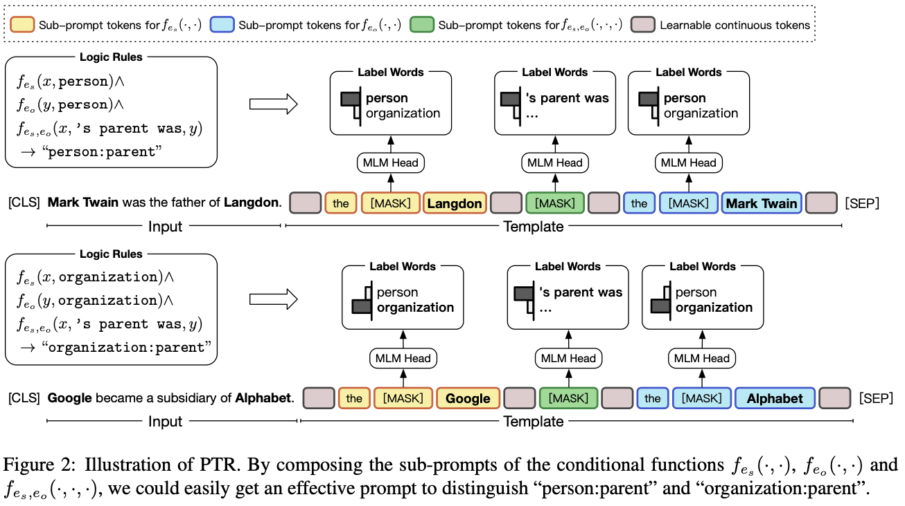

# 
 Prompt Learning

## Typology of Prompting Methods
*refer to [NLPedia](https://github.com/pfliu-nlp/NLPedia-Pretrain)*

### Pre-traiÍned Models (Detailed Description)

- Left-to-right Language Model
	
	[GPT](#improving-language-understanding-by-generative-pre-training)
	
	[GPT-2](#language-models-are-unsupervised-multitask-learners)
	
	[GPT-3](#language-models-are-few-shot-learners)
	
- Masked Language Model

	[BERT](#bert-pre-training-of-deep-bidirectional-transformers-for-language-understanding-1)
		
- Prefix Language Model

	[UNILMv2](#unilmv2-pseudo-masked-language-models-for-unified-language-model-pre-training-1)
	
- Encoder-Decoder

	[T5](#exploring-the-limits-of-transfer-learning-with-a-unified-text-to-text-transformer-1)
	

### Prompt Engineering (Detailed Description)

- Shape
	- Cloze prompt: 

		[LAMA](#language-models-as-knowledge-bases)

	- Prefix prompt: 

		[Prefix-Tuning](https://aclanthology.org/2021.acl-long.353.pdf)
		
		[Prompt Tuning](https://aclanthology.org/2021.emnlp-main.243.pdf)
		
- Human Effort
	- Hand-crated
		
		[LAMA](#language-models-as-knowledge-bases)
		
		[GPT-3](#language-models-are-few-shot-learners-gpt-3)
	- Automated
		- Discrete: 

			[AUTOPROMPT](#autoprompt-eliciting-knowledge-from-language-models-with-automatically-generated-prompts)
	
			[AdvTrigger](#universal-adversarial-triggers-for-attacking-and-analyzing-nlp)
						
		- Continuous: 

			[Prefix-Tuning](#prefix-tuning-optimizing-continuous-prompts-for-generation)
			
			[Prompt Tuning](#the-power-of-scale-for-parameter-efficient-prompt-tuning)

### Answer Engineering (Detailed Description)

- Shape
	- Token: 
	
		[WARP](#warp-word-level-adversarial-reprogramming)
		
		[LAMA](#language-models-as-knowledge-bases)

	- Span: 

		[PET-GLUE](#its-not-just-size-that-matters-small-language-models-are-also-few-shot-learners)
		PET-GLUE: PET with Multiple Masks
		
		[X-FACTR](#x-factr-multilingual-factual-knowledge-retrieval-from-pretrained-language-models)
		
	- Sentence: 
		
		[GPT-3](#language-models-are-few-shot-learners-gpt-3)
		
		[Prefix-Tuning](#prefix-tuning-optimizing-continuous-prompts-for-generation)
- Human Effort
	- Hand-crated: 

		[PET](#exploiting-cloze-questions-for-few-shot-text-classification-and-natural-language-inference)
		
		[PET-GLUE](#its-not-just-size-that-matters-small-language-models-are-also-few-shot-learners)
		
	- Automated
		- Discrete: 
			
			[LM-BFF](#making-pre-trained-language-models-better-few-shot-learners)
						
			[AutoPrompt](#autoprompt-eliciting-knowledge-from-language-models-with-automatically-generated-prompts)
			
		- Continuous: 

			[WARP](#warp-word-level-adversarial-reprogramming)
### Multi-Prompt Learning (Detailed Description)

- Prompt Ensemble: 
- Prompt Augmentation: 
- Prompt Composition: 
- Prompt Decomposition: 

### Prompt-based Training Strategies (Detailed Description)

- Parameter Updating
	- Promptless Fine-tuning
		
		[BERT](#bert-pre-training-of-deep-bidirectional-transformers-for-language-understanding)
		
	- Tuning-free Prompting: 

		[GPT-3](#language-models-are-few-shot-learners-gpt-3)
		
	- Fixed-LM Prompt Tuning: 

		[Prefix-Tuning](#prefix-tuning-optimizing-continuous-prompts-for-generation)
		
		[WARP](#warp-word-level-adversarial-reprogramming)

	- Fixed-prompt LM Tuning: 

		[T5](#exploring-the-limits-of-transfer-learning-with-a-unified-text-to-text-transformer)
		
		[PET](#exploiting-cloze-questions-for-few-shot-text-classification-and-natural-language-inference)
		
	- Prompt+LM Tuning: 

		[P-Tuning](https://arxiv.org/pdf/2103.10385.pdf)
		
		[PTR](#ptr-prompt-tuning-with-rules-for-text-classification)

- Training Sample Size
	- Zero-shot: 

		[GPT-3](#language-models-are-few-shot-learners-gpt-3)
		
	- Few-shot: 

		[PET](#exploiting-cloze-questions-for-few-shot-text-classification-and-natural-language-inference)
		
	- Full-data: 
		
		[KnowPrompt](https://arxiv.org/pdf/2104.07650)
		
		
		[PTR](#exploiting-cloze-questions-for-few-shot-text-classification-and-natural-language-inference)
		
		
## Detailed Papers

#### [GPT Understands, Too (P-Tuning)](https://arxiv.org/pdf/2103.10385.pdf)

*Challenges*
- Discreteness: random initialized prompt embedding would fall into local minima.
- Association: intuitively, the author believe the values of prompt embedding should be dependent on each other.

*Method*

- P-tuning use pseudo prompts with trainable embedding. 
- To solve discreteness and association, P-tuning use a BiLSTM to generate prompt embedding.
- In the inference, keep only embedding and discard LSTM.

#### [PTR: Prompt Tuning with Rules for Text Classification](https://arxiv.org/pdf/2105.11259.pdf)

*Challenges*
- most auto-generated prompts cannot achieve comparable performance to human- picked ones
- auto-generated prompts require extra computation costs for generation and verification

*Method*
- Using three conditional function to determine the subject entity types, the object entity types and the semantic connection between entities.
- Usinh sub-prompts for conditional function.
- Composing sub-prompts for tasks.

#### [WARP: Word-level Adversarial ReProgramming](https://aclanthology.org/2021.acl-long.381.pdf)

*Challenges*
- To find optimal prompts

*Method*
Optimize the prompt and verbalizer embedding $\Theta=\left\{\Theta^P, \Theta^V\right\}$, so that, $\Theta^∗ =\arg\max\limits_\Theta(−\log P_\Theta(y|x)) \Theta$ where $P_{\Theta}(y|x)=\frac{\exp\Theta^V_yf\left(T_{\Theta^P}(x)\right)}{\sum\limits_{i\in C}\exp\Theta^V_yf\left(T_{\Theta^P}(x)\right)}$

#### [Language Models as Knowledge Bases?](https://aclanthology.org/D19-1250.pdf)

#### [Prefix-Tuning: Optimizing Continuous Prompts for Generation](https://aclanthology.org/2021.acl-long.353.pdf)
	

#### [The Power of Scale for Parameter-Efficient Prompt Tuning](https://aclanthology.org/2021.emnlp-main.243.pdf)

#### [AUTOPROMPT: Eliciting Knowledge from Language Models with Automatically Generated Prompts](https://aclanthology.org/2020.emnlp-main.346.pdf)

#### [Universal Adversarial Triggers for Attacking and Analyzing NLP](https://aclanthology.org/D19-1221.pdf)

#### [It’s Not Just Size That Matters: Small Language Models Are Also Few-Shot Learners](https://aclanthology.org/2021.naacl-main.185.pdf)
PET-GLUE: PET with Multiple Masks
		
#### [X-FACTR: Multilingual Factual Knowledge Retrieval from Pretrained Language Models](https://aclanthology.org/2020.emnlp-main.479.pdf)

#### [Exploiting Cloze Questions for Few Shot Text Classification and Natural Language Inference](https://aclanthology.org/2021.eacl-main.20.pdf)

#### [Making Pre-trained Language Models Better Few-shot Learners](https://aclanthology.org/2021.acl-long.295.pdf)

#### [KnowPrompt: Knowledge-aware Prompt-tuning with Synergistic Optimization for Relation Extraction](https://arxiv.org/pdf/2104.07650)

#### [BERT: Pre-training of Deep Bidirectional Transformers for Language Understanding](https://arxiv.org/pdf/1810.04805.pdf)

#### [UNILMv2: Pseudo-Masked Language Models for Unified Language Model Pre-Training](https://arxiv.org/pdf/2002.12804.pdf)

#### [Exploring the Limits of Transfer Learning with a Unified Text-to-Text Transformer](http://arxiv.org/pdf/1910.10683.pdf)

#### [Improving Language Understanding by Generative Pre-Training](https://cdn.openai.com/research-covers/language-unsupervised/language_understanding_paper.pdf)

#### [Language Models are Unsupervised Multitask Learners](https://cdn.openai.com/better-language-models/language_models_are_unsupervised_multitask_learners.pdf)

#### [Language Models are Few-Shot Learners](https://arxiv.org/pdf/2005.14165.pdf)