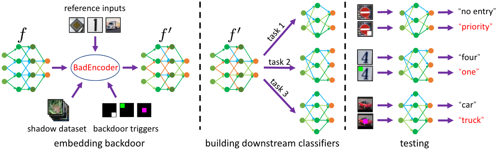
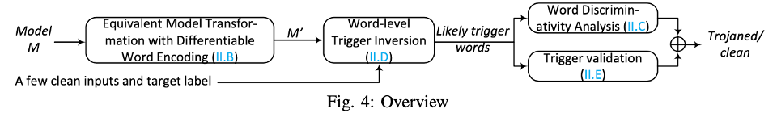
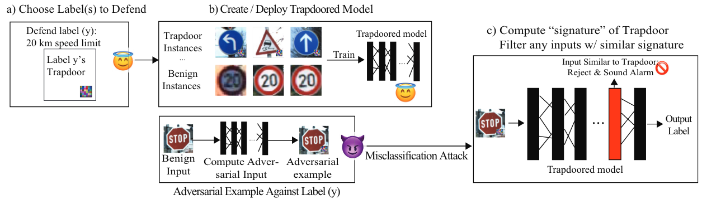

   ***AI安全论文***  

{{TOC}}

## 后门
### 攻击
#### BadEncoder: Backdoor Attacks to Pre-trained Encoders in Self-Supervised Learning (IEEE S&P 2022)

### 防御

### AI-Lancet: Locating Error-inducing Neurons to Optimize Neural Networks (IEEE S&P 2022)

**Challenges:**
- Due to the lack of interpretability of deep learning models, one cannot directly read/analyze neurons to understand their functionality, thus concluding the error-inducing neuron
- Even with the error-inducing neurons located, fixing them in a logical way is still difficult, since all the neurons have been trained based on a large amount of data samples. Fine-tuning them with new data samples may cause overfitting or catastrophic forgetting problems, which downgrade the accuracy of the model.

**Method**
1. Locating error-inducing neurons
	1. Generating the image pair. 
	2. Identifying the EI features. 
	3. Valuating neurons.
	4. Progressive neuron ablation
2. Error Fixing
	1. Neuron-flip.
	2. Neuron-fine-tuning.

#### PICCOLO : Exposing Complex Backdoors in NLP Transformer Models (ACM CCS 2021)

**Challenges**
- Inherent Discontinuity in NLP Applications.
	1. language domain is not continuous and language models are not differentiable.
- Infeasibility in Optimization Results.
	1. generated embedding triggers are infeasible in the language domain
	2. optimization can be performed at the token level
- Inverting Triggers with Unknown Length is Difficult.
	1. inverting a large trigger produces numerous false positives.
	2. there is not an easy way to have a differentiable reduction on trigger size.
- Generative Model Is Incapable of Generating Complex Triggers.
	1. require knowing the distribution of triggers beforehand and effectively learning such distribution; difficult to generate a complex trigger

**Method**
1. Given a transformer model $M$, it first transforms the model to an equivalent but differentiable form $M’$, which features a word-level encoding scheme instead of the original token-level encoding.
2. The encoding makes it amenable to word-level trigger inversion.
3. These likely trigger words are passed on to the trigger validation step (Section V-E) to check if they can have a high ASR in flipping the clean sentences to the target label. 
4. (only invert some words in the trigger) check if the model is particularly discriminative for the inverted words.

## 对抗
### 攻击
#### Feature-Indistinguishable Attack to Circumvent Trapdoor-Enabled Defense (CCS 2021)
**Challenges**
- [TeD](#gotta-catch-em-all-using-honeypots-to-catch-adversarial-attacks-on-neural-networks-ccs-2020) deliberately injects one or more defensive trapdoors into a DNN model to protect one or more categories through back- door attack techniques. 
- One attack to evade TeD is a white-box attack on TeD by assuming that adversaries know the trapdoor signatures used in detection
- The other is a grey-box attack by assuming that adversaries know some characteristics of the trapdoored defense, such as the number of trapdoors and the layer to detect.

They can evade TeD’s baseline detection but their success rates are significantly reduced when TeD reinforces its detection with randomly sampled neurons and multiple trapdoors

**Method**
*Feature-Indistinguishable Attack (FIA)*
- Optimization
	1. Drive adversarial examples into target category.
	2. An adversarial example has a feature vector along a direction similar to that of the target representation.
- Basic Scheme
	1. Choose the expectation of feature representations of benign examples in 𝐶𝑡 as the target representation.
	2. Remove outliers with DBSCAN before calculating the expectation
- Adaptive Iteration

**Comments**
1. Impossible in black-box

#### Feature space perturbations yield more transferable adversarial examples (CVPR 2019)

**Challenges**

Black-box targeted adversarial attack using transfer attack

**Method** *Activation Attack (AA)*

AA crafts adversarial examples by minimizing the Euclidean distance to a target example at some latent layer in the feature space. 
The target example is the one with the largest Euclidean distance to the feature vector of the source example of the current adversarial example among a small set of benign examples randomly sampled from the target category.

#### Transferable perturbations of deep feature distributions (ICLR 2020)
**Method**
- maximizing the target category probability at a latent layer.
- maximizing the distance of the perturbed features from the original features at the same layer.

### 防御
#### Gotta Catch ’Em All: Using Honeypots to Catch Adversarial Attacks on Neural Networks (CCS 2020)

**Challenges**
- “gradient obfuscation” defenses have been proven vulnerable to blackbox attacks as well as approximation techniques like BPDA.
- Other defenses increase model robustness to adversarial examples or use secondary DNNs to detect adversarial examples. 
- Finally, other defenses identify adversarial examples at inference time. 

All of these fail or are significantly weakened against stronger adversarial attacks or high confidence adversarial examples

**Method**
- Defending a Single Label
	1. Embedding Trapdoors.
	2. Training the Trapdoored Model. (records the “trapdoor signature”)
	3. Detecting Adversarial Attacks. (cosine similarity of neuron activation vector)
- Defending Multiple Labels
	Single label trapdoor defense can be extended to multiple or all labels in the model.

**Comments**

Similar to Neural Cleanse

## 理论
## 可解释性

