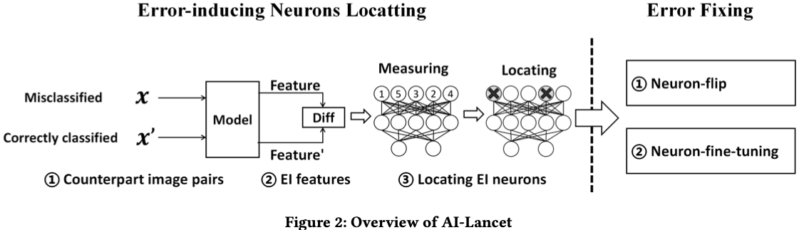

# AI安全论文
{{TOC}}
## 后门
### 攻击
#### BadEncoder: Backdoor Attacks to Pre-trained Encoders in Self-Supervised Learning (IEEE S&P 2022)

### 防御
#### AI-Lancet: Locating Error-inducing Neurons to Optimize Neural Networks (IEEE S&P 2022)

**Challenges:**
- Due to the lack of interpretability of deep learning models, one cannot directly read/analyze neurons to understand their functionality, thus concluding the error-inducing neuron
- Even with the error-inducing neurons located, fixing them in a logical way is still difficult, since all the neurons have been trained based on a large amount of data samples. Fine-tuning them with new data samples may cause overfitting or catastrophic forgetting problems, which downgrade the accuracy of the model.

**Method**
1. Locating error-inducing neurons
	1. Generating the image pair. 
	2. Identifying the EI features. 
	3. Valuating neurons.
	4. Progressive neuron ablation
2. Error Fixing
	1. Neuron-flip.
	2. Neuron-fine-tuning.

#### PICCOLO : Exposing Complex Backdoors in NLP Transformer Models (ACM CCS 2021)

**Challenges**
- Inherent Discontinuity in NLP Applications.
	1. language domain is not continuous and language models are not differentiable.
- Infeasibility in Optimization Results.
	1. generated embedding triggers are infeasible in the language domain
	2. optimization can be performed at the token level
- Inverting Triggers with Unknown Length is Difficult.
	1. inverting a large trigger produces numerous false positives.
	2. there is not an easy way to have a differentiable reduction on trigger size.
- Generative Model Is Incapable of Generating Complex Triggers.
	1. require knowing the distribution of triggers beforehand and effectively learning such distribution; difficult to generate a complex trigger

**Method**
1. Given a transformer model $M$, it first transforms the model to an equivalent but differentiable form $M’$, which features a word-level encoding scheme instead of the original token-level encoding.
2. The encoding makes it amenable to word-level trigger inversion.
3. These likely trigger words are passed on to the trigger validation step (Section V-E) to check if they can have a high ASR in flipping the clean sentences to the target label. 
4. (only invert some words in the trigger) check if the model is particularly discriminative for the inverted words.

## 对抗
### 防御
#### Gotta Catch ’Em All: Using Honeypots to Catch Adversarial Attacks on Neural Networks (CCS 2020)

**Challenges**
- “gradient obfuscation” defenses have been proven vulnerable to blackbox attacks as well as approximation techniques like BPDA.
- Other defenses increase model robustness to adversarial examples or use secondary DNNs to detect adversarial examples. 
- Finally, other defenses identify adversarial examples at inference time. 

All of these fail or are significantly weakened against stronger adversarial attacks or high confidence adversarial examples

**Method**
- Defending a Single Label
	1. Embedding Trapdoors.
	2. Training the Trapdoored Model.
	3. Detecting Adversarial Attacks.
- Defending Multiple Labels
	Single label trapdoor defense can be extended to multiple or all labels in the model.

**Comment**
Similar to Neural Cleanse

## 理论
## 可解释性

