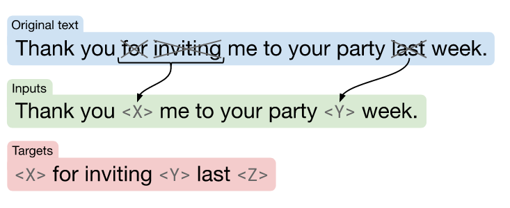
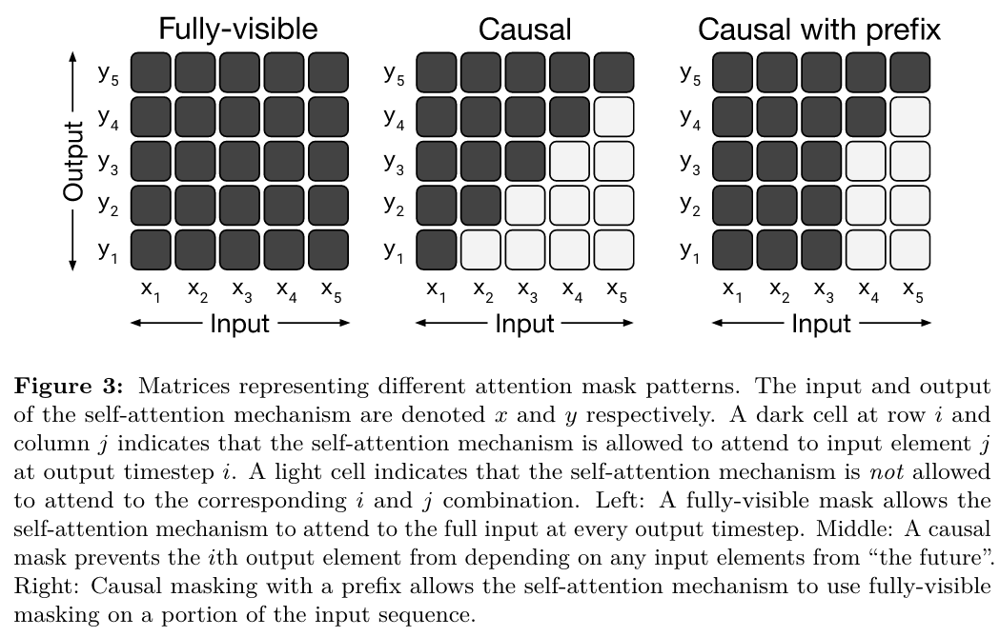
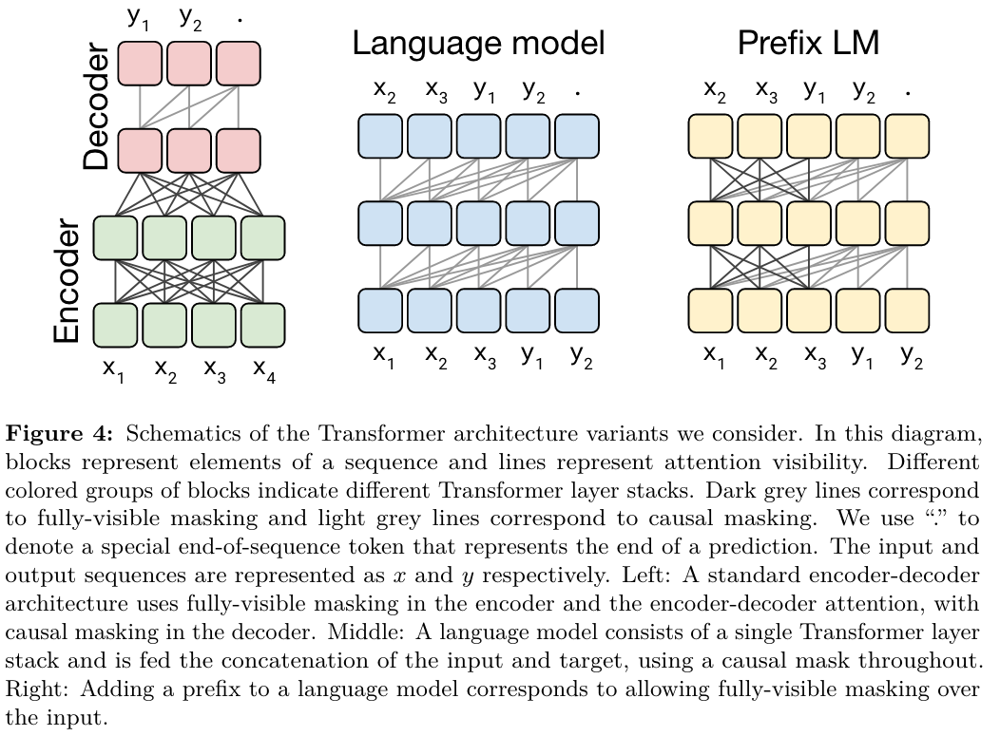

# 
 Exploring the Limits of Transfer Learning with a Unified Text-to-Text Transformer

## Setup
### Model
Original encoder-decoder [Transformer](https://proceedings.neurips.cc/paper/2017/file/3f5ee243547dee91fbd053c1c4a845aa-Paper.pdf) referred as Text-to-Text Transfer Transformer (T5). 

### Pre-training dataset
Colossal Clean Crawled Corpus (C4) from Common Crawl. 

### Downstream tasks
- CoLA
- SST-2
- Paraphrasing/sentence similarity
- NLI
- Sentence completion
- QA
- …

### Input output format

| task | task-specific prefix | 
|:-:|:-:|
| Translation | “translate English to German: X” |
| NLI | “mnli premise: X” |
| Winograd | \*X* |

## Experiments
### Unsupervised objective

### Architectures
#### Model structures

